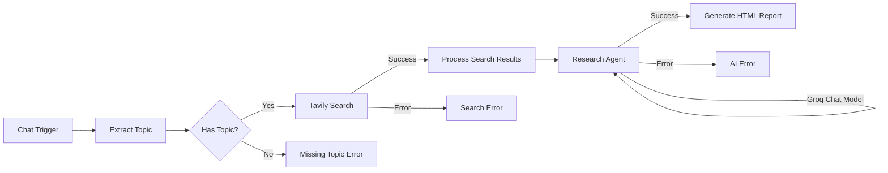

# AI Research Agent

An n8n-based AI automation workflow that accepts a research topic from a user, searches the live web via the Tavily Search API, analyzes and synthesizes the results using a Groq-hosted LLM, and returns a structured, professionally styled HTML research report.

GitHub Repository:
https://github.com/Shreesh636/ai-research-agent
[Live n8n Workflow URL — keep private if your n8n instance is not intended for public sharing]

---

## 1. Project Overview

The AI Research Agent is a workflow-automation project built entirely in **n8n**. A user types a research topic into a chat interface; the workflow validates the topic, performs a live web search with the **Tavily Search API**, hands the retrieved sources to an **AI Agent powered by Groq**, and converts the agent's structured analysis into a clean, browser-ready HTML report — without any manual research or formatting effort from the user.

## 2. Problem Statement

Traditional research is slow and repetitive: a person has to open a search engine, visit multiple websites, read through each one, judge which sources are reliable, manually note down key points, and then organize everything into a coherent, readable document. This process is time-consuming, inconsistent in quality, and difficult to repeat quickly for a new topic. The AI Research Agent automates this entire chain — search, analysis, and report writing — into a single request.

## 3. Project Objective

As defined in Assignment 13.5 ("Research Agent – Build a Production-Ready AI Research Assistant"), the objective is to build a fully functional AI-powered Research Agent capable of searching the web, collecting relevant information, analyzing multiple sources, summarizing findings, and generating a professional research report, while gaining hands-on experience with n8n workflows, HTTP APIs, AI Agents, Groq LLM integration, and automated report generation.

## 4. Key Features

Only features actually present in the implemented workflow are listed:

- Chat-based research topic input
- Input validation (empty/missing topic is caught before any API call)
- Live web search via the Tavily Search API (advanced search depth, up to 8 results, with a quick-answer summary)
- Automated processing/formatting of raw search results into a clean source list
- AI-powered analysis and synthesis of multiple sources using an AI Agent
- Groq-hosted LLM (`openai/gpt-oss-120b`) as the reasoning engine
- Enforced structured report format (fixed Markdown section headings)
- Automatic Markdown-to-HTML conversion with professional styling
- Three explicit error-handling branches: missing topic, search failure, AI failure

## 5. Workflow Architecture



This diagram reflects the actual node graph and connections found in `workflow/AI_Research_Agent.json`.

## 6. Technology Stack

- **n8n** — visual workflow automation engine
- **Tavily Search API** — real-time web search
- **Groq** — high-speed LLM inference provider
- **LangChain Agent node** (`@n8n/n8n-nodes-langchain.agent`) — AI reasoning/orchestration
- **JavaScript (n8n Code nodes)** — result formatting and Markdown-to-HTML conversion
- **HTML/CSS** — final report rendering
- **REST API / HTTP Request node** — Tavily integration

## 7. Detailed Workflow Explanation

| Node | Type | Purpose |
|---|---|---|
| Chat Trigger | `chatTrigger` | Entry point; receives the user's chat message as `chatInput`. |
| Extract Topic | `Set` | Trims the incoming `chatInput` and stores it as `topic`. |
| Has Topic? | `IF` | Checks whether `topic` is non-empty; routes to search or to the missing-topic error path. |
| Tavily Search | `HTTP Request` | POSTs to `https://api.tavily.com/search` with `search_depth: advanced`, `max_results: 8`, `include_answer: true`. Configured with `continueErrorOutput`, so a failure routes to a separate error output instead of stopping the workflow. |
| Process Search Results | `Code` | Parses the Tavily JSON response, builds a numbered, readable source list (title, URL, excerpt) and a Tavily quick-answer string for the AI Agent. |
| Research Agent | `@n8n/n8n-nodes-langchain.agent` | Receives the topic, quick answer, and formatted sources; instructed via a system prompt to synthesize (not copy) the sources into a fixed-section Markdown report. Also uses `continueErrorOutput`. |
| Groq Chat Model | `lmChatGroq` | Supplies the underlying LLM (`openai/gpt-oss-120b`, temperature 0.3, max 4096 tokens) to the Research Agent node. |
| Generate HTML Report | `Code` | Converts the agent's Markdown output into styled, self-contained HTML (headings, lists, links, bold/italic), ready to open directly in a browser. |
| Search Error | `Set` | Returns a static, user-friendly message when the Tavily call fails. |
| AI Error | `Set` | Returns a static, user-friendly message when the Research Agent call fails. |
| Missing Topic Error | `Set` | Returns a static message asking the user to provide a topic. |

## 8. AI Prompt Engineering

The Research Agent's system prompt instructs the model to act as an expert research analyst that:

- Analyzes and synthesizes multiple web sources rather than copying them
- Never pastes source text verbatim
- Produces the report in clean Markdown using an **exact, fixed set of section headings** (Executive Summary, Introduction, Key Findings, Detailed Analysis, Important Facts, Sources/References, Conclusion), in a fixed order
- Cites sources where relevant, listing each source's title and URL
- Stays factual, objective, and professional in tone

Enforcing an exact heading structure is what allows the downstream `Generate HTML Report` code to reliably convert the output into clean HTML without extra parsing logic. Full prompt text is in `documentation/AI_PROMPT_LIBRARY.md`.

## 9. Error Handling

The workflow has three independent, explicit failure paths, each returning a distinct, user-readable message instead of letting the workflow crash silently:

1. **Missing Topic Error** — triggered when the user sends an empty or whitespace-only message.
2. **Search Error** — triggered when the Tavily HTTP request fails (network issue, invalid key, rate limit, etc.), using the node's built-in `continueErrorOutput` setting.
3. **AI Error** — triggered when the Research Agent/Groq call fails, also via `continueErrorOutput`.

## 10. How to Run

1. Open n8n (cloud or self-hosted).
2. Import the workflow JSON from `workflow/AI_Research_Agent.json`.
3. Configure your own **Tavily API** credential (create a credential of the appropriate HTTP auth type and connect it to the "Tavily Search" node).
4. Configure your own **Groq API** credential and connect it to the "Groq Chat Model" node.
5. Open the built-in chat interface for the workflow.
6. Enter a research topic (e.g., *"Impact of Artificial Intelligence on Education"*).
7. Execute the workflow.
8. View the generated HTML report in the node output, or save/open the `output`/`html` field as a `.html` file in your browser.

> Do not commit real API keys. Credentials are configured locally in your own n8n instance and are never stored in the workflow JSON.

## 11. Example Research Topic

```
Impact of Artificial Intelligence on Education
```

## 12. Example Output

The generated report follows this fixed structure every time:

- **Title** — the research topic as an H1 heading
- **Executive Summary** — a short overview paragraph
- **Introduction** — context for the topic
- **Key Findings** — bulleted list of the most important points
- **Detailed Analysis** — deeper discussion synthesizing the sources
- **Important Facts** — bulleted list of standout facts/statistics
- **Sources / References** — list of source titles with clickable URLs
- **Conclusion** — closing summary

See `reports/AI_Research_Report_Demo.html` for a representative rendered example matching the workflow output format. The accompanying screenshot documents the successful live execution.

## 13. Project Advantages

- Fully automated: one chat message produces a complete report
- Uses real-time web data (not just the model's training knowledge)
- Consistent, predictable report structure across any topic
- Fast inference via Groq
- Explicit error handling improves reliability and user experience
- Modular node design makes the workflow easy to extend

## 14. Limitations

- Report quality depends on the quality/coverage of Tavily's search results for a given topic
- No retry mechanism — a single Tavily or Groq failure ends that branch (handled gracefully, but not retried automatically)
- No persistent storage; each report exists only for that execution unless manually saved
- Limited to 8 search results per query (Tavily `max_results` setting)
- No PDF export or downloadable file generation in the current implementation

## 15. Future Scope

The following are **not implemented** in the current workflow and are suggested as future improvements:

- **FUTURE SCOPE:** PDF export of the generated report
- **FUTURE SCOPE:** Database storage of past research reports
- **FUTURE SCOPE:** Source credibility scoring
- **FUTURE SCOPE:** Citation management (e.g., APA/MLA formatting)
- **FUTURE SCOPE:** Multilingual report generation
- **FUTURE SCOPE:** Scheduled/recurring research runs
- **FUTURE SCOPE:** Email delivery of completed reports
- **FUTURE SCOPE:** A dashboard to browse past reports
- **FUTURE SCOPE:** Downloadable report files (HTML/PDF) directly from the chat interface

## 16. Conclusion

The AI Research Agent demonstrates a complete, working application of workflow automation and AI integration: it takes an unstructured user request, performs a real web search, applies LLM-based reasoning to synthesize multiple sources, and returns a polished, structured report — with proper handling for the cases where any step fails. It satisfies the core requirements of Assignment 13.5 using n8n, the Tavily Search API, and a Groq-hosted LLM.

## 17. Author

**Shreesh**
