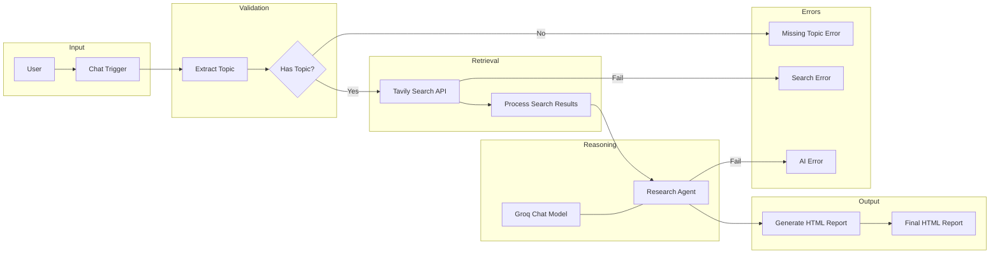
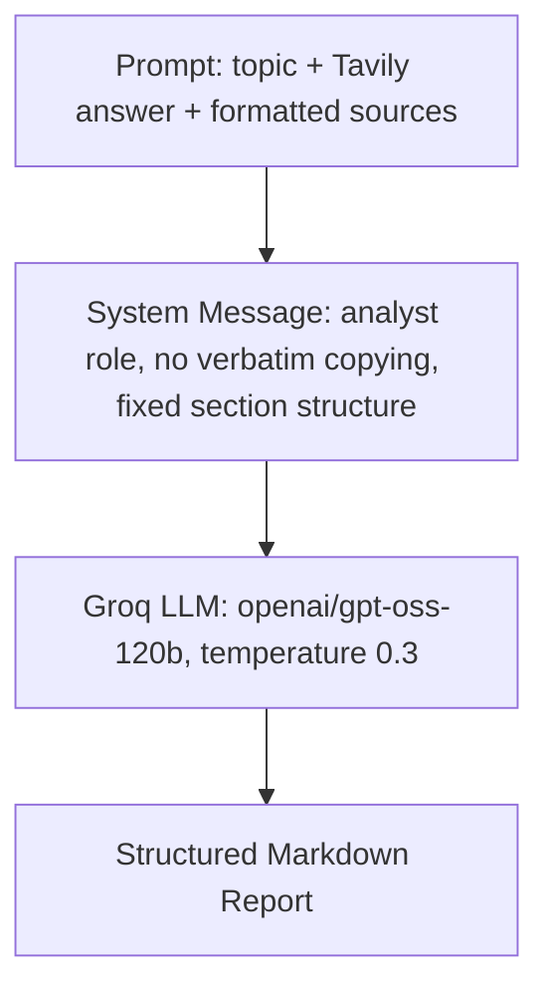
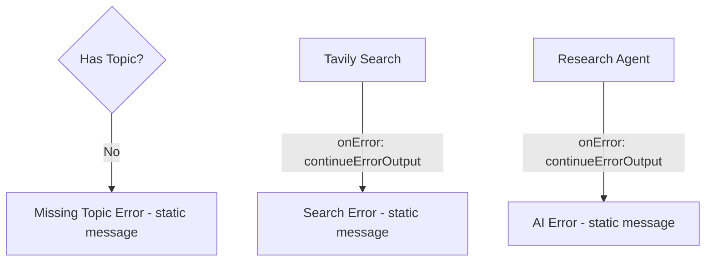
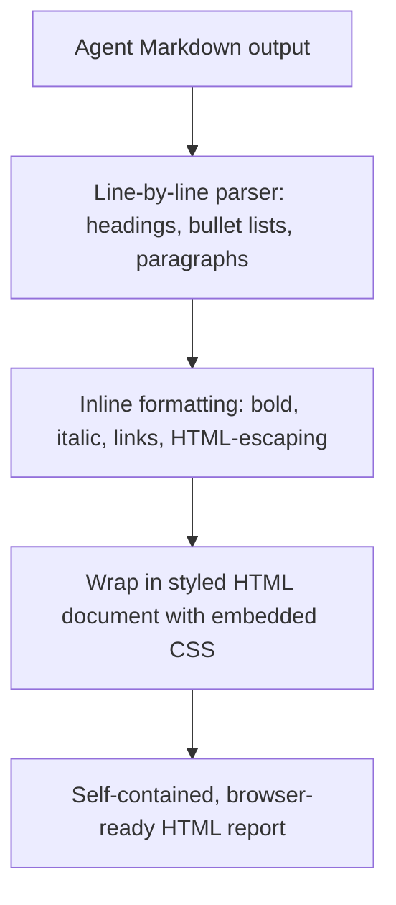

# AI Research Agent — Architecture Document

## 1. High-Level Architecture



## 2. Node Architecture

The workflow contains 11 nodes across three functional groups (as defined in the exported workflow's `nodeGroups`):

| Group | Nodes |
|---|---|
| Validate topic | Extract Topic, Has Topic? |
| Search the web | Tavily Search, Process Search Results, Search Error |
| Generate report | Research Agent, Groq Chat Model, AI Error, Generate HTML Report |
| (Entry / fallback, ungrouped) | Chat Trigger, Missing Topic Error |

## 3. Data Flow

```
chatInput (string)
   → topic (trimmed string)
      → Tavily request body: { query: topic, search_depth: "advanced", max_results: 8, include_answer: true }
         → Tavily response: { results: [...], answer: "..." }
            → { topic, answer, sourcesText, sourceList }
               → Research Agent prompt (topic + answer + sourcesText)
                  → Agent output: Markdown report (fixed headings)
                     → Generate HTML Report: { output: html, html: html, topic }
```

## 4. API Flow

1. **Chat Trigger → Extract Topic**: internal n8n data pass, no external call.
2. **Tavily Search**: `POST https://api.tavily.com/search` (HTTPS, JSON body, auth via stored credential, 30s timeout).
3. **Research Agent → Groq Chat Model**: internal LangChain call to Groq's chat-completions endpoint (model `openai/gpt-oss-120b`) via the `lmChatGroq` node, using a stored Groq credential.

No other external APIs are called by this workflow.

## 5. AI Processing Flow



## 6. Error Handling Flow



Both external-call nodes (`Tavily Search`, `Research Agent`) are configured with `onError: continueErrorOutput`, which routes execution to a dedicated error-output branch rather than throwing an unhandled workflow error. This is the standard n8n mechanism used here for graceful degradation.

## 7. HTML Generation Flow



The `Generate HTML Report` Code node performs a minimal, purpose-built Markdown parser (not a general-purpose library) that recognizes `#`–`######` headings, `-`/`*` bullet lines, and paragraph text, and escapes HTML special characters before applying inline formatting (bold `**`, italic `*`, Markdown links) — sufficient because the system prompt constrains the AI's output to this exact subset of Markdown.

## 8. Notes on Scope

All diagrams above describe the workflow exactly as implemented in `workflow/AI_Research_Agent.json`. No hypothetical nodes or connections have been added.
