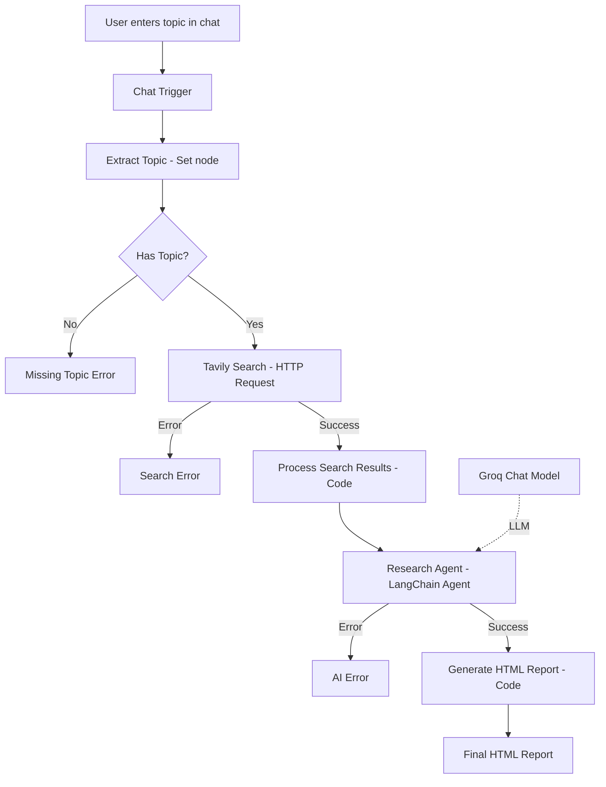

# AI Research Agent — Project Report

**Student:** Shreesh
**Program:** B.Tech, Computer Science and Engineering
**Assignment:** 13.5 — Research Agent: Build a Production-Ready AI Research Assistant

---

## 1. Title Page

**Project Title:** AI Research Agent
**Submitted By:** Shreesh
**Course:** B.Tech CSE
**Tool Used:** n8n (Workflow Automation)

---

## 2. Certificate / Declaration (Placeholder)

*This is to certify that the project titled "AI Research Agent" is submitted by Shreesh in partial fulfilment of the requirements of the assignment. The work presented is original and was carried out as part of the coursework.*

*(To be signed/stamped by the concerned faculty, if applicable.)*

---

## 3. Acknowledgement

I would like to thank my instructors and mentors for their guidance throughout this assignment, and for providing the structured problem statement that made it possible to design and implement this project end-to-end.

---

## 4. Abstract

This project presents the design and implementation of an AI Research Agent using the n8n workflow automation platform. The system accepts a research topic through a chat interface, performs a live web search using the Tavily Search API, and passes the retrieved sources to an AI Agent backed by a Groq-hosted large language model. The AI Agent synthesizes the sources into a structured research report, which is then programmatically converted into a styled, browser-ready HTML document. The workflow also implements explicit error handling for missing input, search failures, and AI failures. The result is a fully automated pipeline that replaces the manual process of searching, reading, and compiling research into a single automated request.

---

## 5. Introduction

Research is a foundational activity across academic and professional work, but it is also repetitive and time-intensive when done manually: identifying reliable sources, reading through them, and synthesizing findings into a coherent report can take significant time even for a single topic. Recent advances in large language models (LLMs) and workflow automation tools make it possible to automate large parts of this process. This project uses **n8n**, a visual workflow automation tool, to orchestrate a pipeline that combines a real-time search API with an LLM-powered analysis step, producing a structured HTML report from a single user-provided topic.

---

## 6. Problem Statement

Manually researching a topic requires a person to repeatedly search, open, and read multiple web pages, judge the relevance and reliability of each source, extract key points, and then organize everything into a structured written report. This is slow, inconsistent between attempts, and difficult to scale to many topics. There is a need for a system that can accept a topic, gather current information from the web, analyze and synthesize it, and output a clean, structured report — automatically.

---

## 7. Objectives

1. Build a workflow that accepts a research topic via a chat interface.
2. Validate that a topic was actually provided before performing any external calls.
3. Integrate the Tavily Search API to retrieve real, current web search results.
4. Use an AI Agent, powered by a Groq-hosted LLM, to analyze and synthesize the retrieved sources into a structured report rather than copying them.
5. Convert the AI-generated report into a professional, browser-ready HTML document.
6. Implement clear error handling for missing input, search failures, and AI failures.
7. Document and test the complete workflow for submission.

---

## 8. Existing System

Conventionally, research is performed manually: a person uses a search engine, opens several results, reads each one, and manually compiles notes into a document (e.g., in Word or Google Docs). Some existing tools offer AI-assisted writing or summarization of a single pasted document, but they typically do not combine live web search, multi-source synthesis, and automatic structured-report generation into a single automated pipeline driven by one user request.

---

## 9. Proposed System

The proposed system is a single n8n workflow, "AI Research Agent," that:

- Accepts a topic via a chat trigger
- Validates the input
- Performs a live search using the Tavily Search API
- Passes the formatted search results to an AI Agent (Groq LLM) with a system prompt that enforces analysis and a fixed report structure
- Converts the AI's Markdown output into styled HTML
- Handles missing input, search failure, and AI failure as distinct, user-visible outcomes

---

## 10. System Architecture



---

## 11. Workflow Design

The workflow is organized into three logical groups (as reflected in the exported JSON's `nodeGroups`):

1. **Validate topic** — Extract Topic, Has Topic?
2. **Search the web** — Tavily Search, Process Search Results, Search Error
3. **Generate report** — Research Agent, Groq Chat Model, AI Error, Generate HTML Report

This grouping keeps each concern (input validation, data retrieval, report generation) isolated and independently testable.

---

## 12. Technology Stack

| Layer | Technology |
|---|---|
| Automation Platform | n8n |
| Search | Tavily Search API |
| AI Reasoning | LangChain Agent node + Groq Chat Model (`openai/gpt-oss-120b`) |
| Scripting | JavaScript (n8n Code nodes) |
| Output Format | HTML/CSS |
| Communication | REST APIs over HTTPS |

---

## 13. Detailed Implementation

### 13.1 Chat Trigger
Receives the user's message as `chatInput` and starts the workflow.

### 13.2 Extract Topic
A `Set` node trims `chatInput` (`($json.chatInput || "").toString().trim()`) and stores it in a `topic` field, so downstream nodes always work with a clean value.

### 13.3 Has Topic?
An `IF` node checks that `topic` is not empty (`notEmpty` string operation). This single validation prevents wasted API calls when no topic is supplied.

### 13.4 Tavily Search
An `HTTP Request` node sends a `POST` to `https://api.tavily.com/search` with a JSON body:
```json
{
  "query": "<topic>",
  "search_depth": "advanced",
  "max_results": 8,
  "include_answer": true,
  "topic": "general"
}
```
Authentication is handled via a stored credential (`Tavily API (Shreesh)`), referenced only by name/ID — never exposed in the JSON. A 30-second timeout is set, and `onError: continueErrorOutput` routes failures to a separate branch instead of stopping the workflow.

### 13.5 Process Search Results
A `Code` node parses the Tavily response body, extracts `results` and `answer`, and builds:
- `sourcesText` — a numbered, human-readable list of title, URL, and excerpt for each result
- `sourceList` — a structured array of `{ title, url }`
- `topic` and `answer` passed through for the next node

### 13.6 AI Research Agent
A LangChain **Agent** node (`@n8n/n8n-nodes-langchain.agent`) receives a prompt containing the topic, Tavily's quick answer, and the formatted source list. Its system message instructs it to synthesize (not copy) the sources into a Markdown report with a fixed set of section headings (see Section 20 — Prompt Engineering). `onError: continueErrorOutput` again ensures graceful failure handling.

### 13.7 Groq Chat Model
Supplies the LLM backing the Research Agent: model `openai/gpt-oss-120b`, `temperature: 0.3` (favoring factual, consistent output over creativity), `maxTokensToSample: 4096`.

### 13.8 Generate HTML Report
A second `Code` node takes the agent's Markdown `output`, parses headings (`#`–`######`), bullet lists, bold/italic text, and Markdown links, and converts them into semantic HTML (`<h1>`–`<h6>`, `<ul><li>`, `<strong>`, `<em>`, `<a>`), wrapped in a styled, self-contained HTML document (embedded CSS, no external dependencies) with a footer showing the generation date.

### 13.9 Error Nodes
Three `Set` nodes (`Missing Topic Error`, `Search Error`, `AI Error`) each return a single static, descriptive `output` message so the user always receives clear, actionable feedback instead of a raw error.

---

## 14. Tavily Search API

Tavily is a search API purpose-built for AI applications. It is used here in `advanced` search-depth mode, returning up to 8 ranked results along with an optional synthesized "quick answer." This gives the AI Agent real, current information beyond its training data, which is essential for producing an up-to-date research report.

---

## 15. AI Research Agent

The Research Agent is the reasoning core of the workflow. It does not simply return the raw search results; it is explicitly instructed to analyze, cross-reference, and synthesize them into original prose organized under a strict set of headings, which keeps the output both informative and structurally predictable for the HTML-conversion step that follows.

---

## 16. Groq Chat Model

Groq provides fast LLM inference. The workflow uses the `openai/gpt-oss-120b` model through Groq's API with a low temperature (0.3) to prioritize factual consistency over creative variation — appropriate for a research/report-writing task.

---

## 17. Search Result Processing

Raw Tavily JSON is not directly usable as an LLM prompt. The `Process Search Results` Code node reformats it into a clean, numbered plain-text block (title, URL, excerpt per source), which is easier for the LLM to parse and cite correctly, and also preserves a structured `sourceList` for potential future use (e.g., a references section built without relying on the LLM).

---

## 18. HTML Report Generation

The final Code node performs a lightweight Markdown-to-HTML conversion tailored to the exact section headings enforced by the system prompt, then wraps the result in a styled `<div class="report">` with embedded CSS — producing a single self-contained HTML file that opens correctly in any browser without external assets.

---

## 19. Error Handling

| Failure Point | Node | Behavior |
|---|---|---|
| No topic provided | Has Topic? → Missing Topic Error | Returns: "No research topic was provided. Please send a topic you would like me to research." |
| Tavily API call fails | Tavily Search → Search Error | Returns: "The web search request failed. Please check the Tavily API credential and try again later." |
| AI Agent/Groq call fails | Research Agent → AI Error | Returns: "The AI model failed to generate the research report. Please check the Groq credential and try again." |

Each branch is isolated so that a failure at one stage cannot silently corrupt or block the rest of the workflow.

---

## 20. Prompt Engineering

The system prompt fixes the AI Agent's role ("expert research analyst"), forbids copying source text verbatim, and mandates an exact Markdown structure:

```
# <Research Title>
## Executive Summary
## Introduction
## Key Findings (bulleted list)
## Detailed Analysis
## Important Facts (bulleted list)
## Sources / References (title + URL per source)
## Conclusion
```

This structural constraint is what makes the downstream HTML generation reliable — because the heading text and order are fixed, the Code node does not need complex natural-language parsing to build correct HTML. See `AI_PROMPT_LIBRARY.md` for the full prompt text.

---

## 21. Testing

The workflow was executed live in n8n using real Tavily and Groq credentials (see accompanying execution screenshot). The test confirmed genuine external API calls (a real Tavily `request_id` and response time were observed), correct data hand-off between nodes, and a valid final HTML report containing all required sections.

---

## 22. Test Cases

See the dedicated test case table (below and in `SUBMISSION_CHECKLIST.md`/README). In summary:

| # | Scenario | Status |
|---|---|---|
| 1 | Valid topic → full report generated | **Tested Successfully** (per execution screenshot) |
| 2 | Empty topic → Missing Topic Error | Expected Behavior (per workflow logic) |
| 3 | Tavily failure → Search Error | Expected Behavior (per `onError` configuration) |
| 4 | Groq/AI failure → AI Error | Expected Behavior (per `onError` configuration) |

---

## 23. Results

For the topic "Impact of Artificial Intelligence on Education," the workflow returned a complete HTML report containing all required sections (Executive Summary, Introduction, Key Findings, Detailed Analysis, Important Facts, Sources/References, Conclusion), citing the actual sources returned by Tavily for that run, as evidenced by the provided execution screenshot.

---

## 24. Advantages

- End-to-end automation of a traditionally manual, multi-step research process
- Uses live web data rather than relying solely on the LLM's training knowledge
- Predictable, consistent report structure for any topic
- Explicit, user-friendly error handling at every external-call boundary
- Clear modular design that separates validation, search, and generation concerns

---

## 25. Limitations

- Report quality is bounded by the quality of Tavily's results for a given topic
- No automatic retry after a Tavily or Groq failure
- No persistent storage of generated reports
- Fixed at 8 search results per query
- No built-in PDF export

---

## 26. Future Scope

PDF export, database storage of reports, source credibility scoring, citation management, multilingual output, scheduled research runs, email delivery, a report-browsing dashboard, and downloadable report files are all realistic extensions not present in the current implementation (see README Section 15 for the full list).

---

## 27. Conclusion

The AI Research Agent successfully demonstrates the integration of workflow automation, a real-time web search API, and an LLM-based AI Agent to automate the research-and-reporting process end-to-end. It satisfies the core requirements of Assignment 13.5 and provides a solid, extensible foundation for further enhancements.

---

## 28. References

1. n8n Documentation — https://docs.n8n.io
2. Tavily Search API Documentation — https://docs.tavily.com
3. Groq Documentation — https://console.groq.com/docs
4. The AI School, Assignment 13.5 — "Research Agent: Build a Production-Ready AI Research Assistant"
